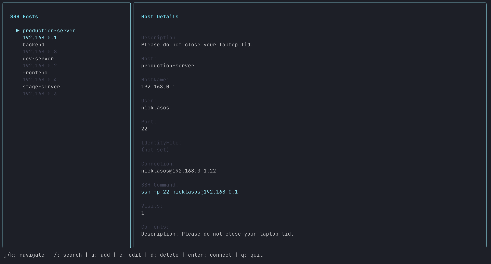

# Go SSH it (gosshit)

A vim-inspired terminal user interface (TUI) for managing SSH config files. Easily browse, search, edit, and connect to your SSH hosts with a beautiful, keyboard-driven interface.



## Features

- **Two-panel interface**: Browse hosts on the left, view details on the right
- **Vim-like keybindings**: Navigate with `j`/`k`, search with `/`, and more
- **Visit tracking**: Most frequently used hosts appear at the top
- **Full CRUD operations**: Add, edit, and delete SSH config entries
- **Search functionality**: Quickly find hosts by name, hostname, user, or description
- **Preserves formatting**: Maintains comments and formatting in your SSH config file
- **Descriptions**: Add descriptions to hosts for better organization
- **Clear visit history**: Reset visit counts with `x` hotkey

## Installation

### Option 1: Homebrew (macOS/Linux) 🍺

```bash
brew install nicklasos/tap/gosshit
```

### Option 2: Download Binary 📦

Download the latest binary for your platform from the [releases page](https://github.com/nicklasos/gosshit/releases).

**macOS:**
```bash
# Intel Mac
curl -L https://github.com/nicklasos/gosshit/releases/latest/download/gosshit_Darwin_x86_64.tar.gz | tar xz
sudo mv gosshit /usr/local/bin/

# Apple Silicon (M1/M2)
curl -L https://github.com/nicklasos/gosshit/releases/latest/download/gosshit_Darwin_arm64.tar.gz | tar xz
sudo mv gosshit /usr/local/bin/
```

**Linux:**
```bash
# AMD64
curl -L https://github.com/nicklasos/gosshit/releases/latest/download/gosshit_Linux_x86_64.tar.gz | tar xz
sudo mv gosshit /usr/local/bin/

# ARM64
curl -L https://github.com/nicklasos/gosshit/releases/latest/download/gosshit_Linux_arm64.tar.gz | tar xz
sudo mv gosshit /usr/local/bin/
```

**Windows:**
Download the `.zip` file from [releases](https://github.com/nicklasos/gosshit/releases) and extract it to a directory in your PATH.

### Option 3: Install with Go

```bash
go install github.com/nicklasos/gosshit@latest
```

Make sure `$GOPATH/bin` or `$GOBIN` is in your PATH.

## Usage

Simply run:

```bash
gosshit
```

The application will:
1. Read your `~/.ssh/config` file (creating it if it doesn't exist)
2. Load visit tracking data from `~/.gosshit` (creating it if it doesn't exist)
3. Display all your SSH hosts sorted by visit frequency

## Keybindings

### Normal Mode (List View)

- `j` / `↓` - Move down in the list
- `k` / `↑` - Move up in the list
- `/` - Enter search mode
- `a` - Add a new host entry
- `e` - Edit the selected host entry
- `d` - Delete the selected host entry
- `x` - Clear all visit counts (with confirmation)
- `Enter` - Connect to the selected host via SSH
- `q` / `Ctrl+C` - Quit the application

### Search Mode

- Type to filter the host list in real-time
- `Enter` - Exit search mode and select first match
- `Esc` - Cancel search and return to normal mode

### Edit Mode

- `Tab` - Move to the next field
- `Shift+Tab` - Move to the previous field
- `Enter` - Save changes
- `Esc` - Cancel editing and return to normal mode

### Delete Confirmation

- `y` - Confirm deletion
- `n` / `Esc` - Cancel deletion

## SSH Config Format

The tool expects standard SSH config format. Descriptions are stored as comments above the Host entry:

```
# Description: My production server
Host prod
    HostName example.com
    User deploy
    Port 22
    IdentityFile ~/.ssh/id_rsa
```

### Supported Fields

- **Host** - The host alias (required)
- **HostName** - The actual hostname or IP address (required)
- **User** - Username for SSH connection (optional, defaults to "root" in editor)
- **Port** - SSH port (optional, defaults to "22" in editor)
- **IdentityFile** - Path to SSH private key (optional, enter path manually)
- **Description** - Added as a comment above the Host entry

## Visit Tracking

The tool tracks how often you connect to each host and automatically sorts them by visit frequency. This data is stored in `~/.gosshit` as a simple text file:

```
prod:42
dev:15
staging:8
```

## Development

To build from source:

```bash
git clone https://github.com/nicklasos/gosshit.git
cd gosshit
go build -o gosshit
```

### Using the Makefile

The project includes a Makefile with convenient commands:

```bash
make build         # Build the binary
make install       # Install to GOPATH/bin
make test          # Run tests
make test-verbose  # Run tests with verbose output
make coverage      # Run tests with coverage report (generates coverage.html)
make clean         # Remove build artifacts
make run           # Build and run the application
make fmt           # Format code with gofmt
make vet           # Run go vet
make check         # Run fmt, vet, and test
make help          # Show all available commands
```

### Running Tests

```bash
# Quick test run
make test

# Verbose test output
make test-verbose

# Generate coverage report
make coverage
# Opens coverage.html in your browser
```

## Requirements

- Go 1.21 or later
- A terminal with support for ANSI colors

## License

MIT
